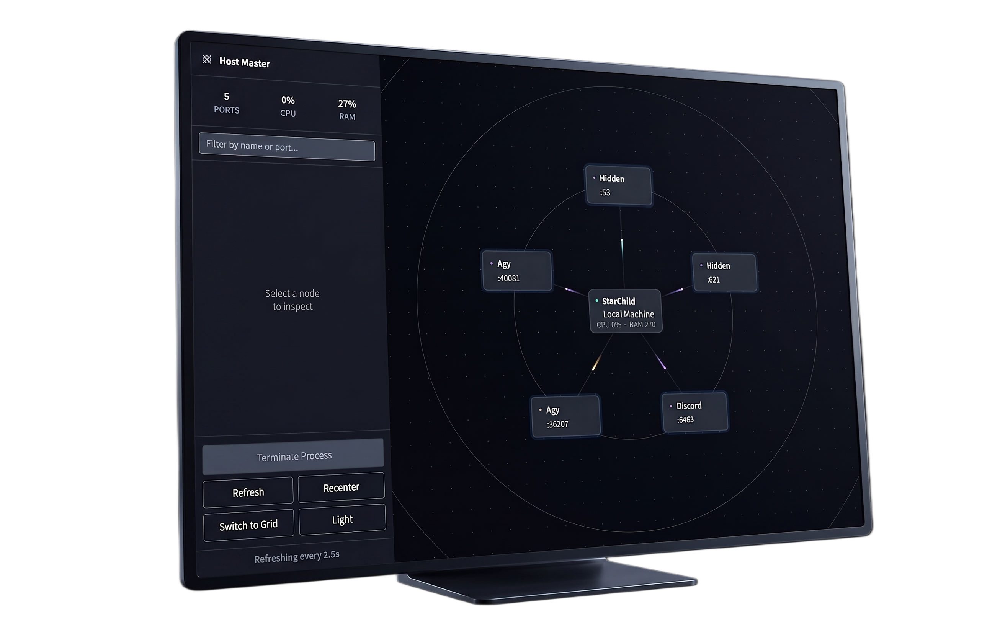

```text
|\     /|  _______   _______  _________  _______   _______   _______  _________  _______   _______ 
| )   ( | (  ___  ) (  ____ \ \__   __/ (       ) (  ___  ) (  ____ \ \__   __/ (  ____ \ (  ____ )
| (___) | | (   ) | | (    \/    ) (    | () () | | (   ) | | (    \/    ) (    | (    \/ | (    )|
|  ___  | | |   | | | (_____     | |    | || || | | (___) | | (_____     | |    | (__     | (____)|
| (   ) | | |   | | (_____  )    | |    | |(_)| | |  ___  | (_____  )    | |    |  __)    |     __)
| )   ( | | (___) |       ) |    | |    | )   ( | | )   ( |       ) |    | |    | (       | (\ (   
|/     \| (_______) \_______)    )_(    |/     \| |/     \| \_______)    )_(    (_______/ |/  \__/
```
                                                                                                            
                                                                                                            
                                                                                                            

                                                                                                            
> 𝒔𝒆𝒆 𝒘𝒉𝒂𝒕 𝒊𝒔 𝒓𝒖𝒏𝒏𝒊𝒏𝒈 𝒐𝒏 𝒚𝒐𝒖𝒓 𝒎𝒂𝒄𝒉𝒊𝒏𝒆. 𝒖𝒏𝒅𝒆𝒓𝒔𝒕𝒂𝒏𝒅 𝒊𝒕. 𝒕𝒂𝒌𝒆 𝒂𝒄𝒕𝒊𝒐𝒏.


<div align="center">

<a href="https://github.com/StarBorn1v1/HostMaster/releases/latest">
  
</a>
<a href="https://discord.com/invite/4DNhRb87my">
  
</a>

<br/><br/>


<p>
  <a href="#features">Features</a> ·
  <a href="#how-it-works">How It Works</a> ·
  <a href="#safety--process-termination">Safety</a> ·
  <a href="#development-environment">Development</a> ·
  <a href="#future-distribution">Future Distribution</a> ·
  <a href="#license">License</a>
</p>

<p>
  <a href="https://github.com/StarBorn1v1/HostMaster/stargazers">
    
  </a>
  <a href="https://github.com/StarBorn1v1/HostMaster/network/members">
    
  </a>
  <a href="https://github.com/StarBorn1v1/HostMaster/blob/main/LICENSE">
    
  </a>
  <a href="https://github.com/StarBorn1v1/HostMaster/releases/latest">
    
  </a>
</p>

</div>


𝙃𝙊𝙎𝙏 𝙈𝘼𝙎𝙏𝙀𝙍 𝙄𝙎 𝘼 𝙇𝙄𝙂𝙃𝙏𝙒𝙀𝙄𝙂𝙃𝙏, 𝙉𝘼𝙏𝙄𝙑𝙀 𝘿𝙀𝙑𝙀𝙇𝙊𝙋𝙀𝙍 𝙐𝙏𝙄𝙇𝙄𝙏𝙔 𝘿𝙀𝙎𝙄𝙂𝙉𝙀𝘿 𝙏𝙊 𝙋𝙍𝙊𝙑𝙄𝘿𝙀 𝘼 𝙑𝙄𝙎𝙐𝘼𝙇 𝙊𝙑𝙀𝙍𝙑𝙄𝙀𝙒 𝙊𝙁 𝙏𝙃𝙀 𝙇𝙄𝙎𝙏𝙀𝙉𝙄𝙉𝙂 𝙉𝙀𝙏𝙒𝙊𝙍𝙆 𝙎𝙀𝙍𝙑𝙄𝘾𝙀𝙎 𝘼𝙉𝘿 𝙋𝙍𝙊𝘾𝙀𝙎𝙎𝙀𝙎 𝙍𝙐𝙉𝙉𝙄𝙉𝙂 𝙊𝙉 𝙔𝙊𝙐𝙍 𝙇𝙊𝘾𝘼𝙇 𝙈𝘼𝘾𝙃𝙄𝙉𝙀.


𝙄𝙉𝙎𝙏𝙀𝘼𝘿 𝙊𝙁 𝘿𝙍𝙊𝙋𝙋𝙄𝙉𝙂 𝙄𝙉𝙏𝙊 𝘼 𝙏𝙀𝙍𝙈𝙄𝙉𝘼𝙇 𝘼𝙉𝘿 𝘾𝙃𝘼𝙄𝙉𝙄𝙉𝙂 `𝙇𝙎𝙊𝙁`, `𝙉𝙀𝙏𝙎𝙏𝘼𝙏`, 𝘼𝙉𝘿 `𝙆𝙄𝙇𝙇` 𝘾𝙊𝙈𝙈𝘼𝙉𝘿𝙎, 𝙃𝙊𝙎𝙏 𝙈𝘼𝙎𝙏𝙀𝙍 𝘼𝘾𝙏𝙎 𝘼𝙎 𝘼𝙉 "𝘼𝙄𝙍-𝙏𝙍𝘼𝙁𝙁𝙄𝘾 𝘾𝙊𝙉𝙏𝙍𝙊𝙇" 𝙁𝙊𝙍 𝙔𝙊𝙐𝙍 𝙇𝙊𝘾𝘼𝙇 𝘿𝙀𝙑𝙀𝙇𝙊𝙋𝙈𝙀𝙉𝙏 𝙀𝙉𝙑𝙄𝙍𝙊𝙉𝙈𝙀𝙉𝙏. 𝙄𝙏 𝙈𝘼𝙋𝙎 𝙊𝙐𝙏 𝙔𝙊𝙐𝙍 𝘼𝘾𝙏𝙄𝙑𝙀 𝙋𝙊𝙍𝙏𝙎, 𝙄𝘿𝙀𝙉𝙏𝙄𝙁𝙄𝙀𝙎 𝙏𝙃𝙀 𝙋𝙍𝙊𝘾𝙀𝙎𝙎𝙀𝙎 𝙃𝙊𝙇𝘿𝙄𝙉𝙂 𝙏𝙃𝙀𝙈, 𝘼𝙉𝘿 𝙂𝙄𝙑𝙀𝙎 𝙔𝙊𝙐 𝘼 𝙎𝙏𝙍𝘼𝙄𝙂𝙃𝙏𝙁𝙊𝙍𝙒𝘼𝙍𝘿 𝙒𝘼𝙔 𝙏𝙊 𝙈𝘼𝙉𝘼𝙂𝙀 𝙏𝙃𝙀𝙈.


<p align="center">
      
    </p>


𝖑𝖎𝖓𝖚𝖝 𝖉𝖊𝖘𝖐𝖙𝖔𝖕 𝖚𝖙𝖎𝖑𝖎𝖙𝖞 𝖋𝖔𝖗 𝖗𝖊𝖆𝖑-𝖙𝖎𝖒𝖊 𝖛𝖎𝖘𝖚𝖆𝖑𝖎𝖟𝖆𝖙𝖎𝖔𝖓 𝖆𝖓𝖉 𝖒𝖆𝖓𝖆𝖌𝖊𝖒𝖊𝖓𝖙 𝖔𝖋 𝖑𝖎𝖘𝖙𝖊𝖓𝖎𝖓𝖌 𝖓𝖊𝖙𝖜𝖔𝖗𝖐 𝖕𝖔𝖗𝖙𝖘 𝖆𝖓𝖉 𝖗𝖔𝖔𝖙-𝖑𝖊𝖛𝖊𝖑 𝖕𝖗𝖔𝖈𝖊𝖘𝖘𝖊𝖘. 


## Download

### Linux

**Host Master v0.1.0** is currently distributed as an `x86_64` AppImage for 64-bit Intel and AMD Linux systems.

[Download Host Master for Linux](https://github.com/StarBorn1v1/HostMaster/releases/download/v0.1.0/Host-Master-x86_64.AppImage)

#### Target Linux Distributions 


The x86_64 AppImage is intended for modern 64-bit desktop Linux distributions, including:

- Linux Mint
- Ubuntu
- Debian
- Fedora
- Arch Linux
- Manjaro
- Pop!_OS
- Zorin OS
- openSUSE
- elementary OS
- EndeavourOS


> **Architecture:** x86_64 / AMD64  
> **Package:** AppImage  
> **Release:** v0.1.0

𝙃𝙊𝙎𝙏 𝙈𝘼𝙎𝙏𝙀𝙍 is targeted at those distributions but I haven't tested 𝙃𝙊𝙎𝙏 𝙈𝘼𝙎𝙏𝙀𝙍 on every one of those distributions 


## Features

- **Local Host Overview:** The central hub visualizes your machine's global resources (CPU %, RAM usage, Disk I/O, and active listeners).

- **Port & Process Visualization:** A dynamic, orbital "lattice" view graphs your active listening ports and their associated services.

- **Process Inspection:** Select any node to reveal its underlying PID, IP, port, and the full command-line arguments that started it.

- **Progressive Reveal for Protected Processes:** If a port is occupied by a root-level process (e.g., Docker containers), Host Master detects it and provides an integrated, OS-style authentication prompt (`sudo`) to inspect and manage it securely.

- **Process Termination:** Safely terminate lingering development servers or stuck processes directly from the UI (sends `SIGTERM`, falling back to `SIGKILL`).

- **Alternative Grid View:** Switch to a structured table view for a traditional, dense data layout.

- **Native Interface:** Hardware-accelerated Qt GUI with full support for Light and Dark modes.

## Why Host Master Exists

Developers frequently have multiple local services running simultaneously: development servers, APIs, databases, test environments, and background containers. 

While traditional terminal commands can identify these processes, a visual overview makes the relationships easier to understand instantly. Host Master exists to provide that visual layer. It doesn't replace your system diagnostic tools—it complements them by making your local port activity immediately visible and actionable.

## How It Works

Host Master securely queries the OS kernel to find all processes explicitly in a `LISTEN` state. 

* **The Hub:** The center node represents your host machine and system resources.

* **The Nodes:** Surrounding nodes represent active listening ports. 

* **The Action:** Clicking a node pulls up the Inspector panel, giving you the context needed to safely terminate the process if it's no longer needed.

## Safety & Process Termination

**Caution:** Host Master gives you the ability to terminate processes. Terminating the wrong system-critical process or background service can disrupt your operating system or local applications. 

Always verify the command-line arguments and process name in the Inspector panel before terminating a process. For root-level processes (like Docker daemons), Host Master will require elevated privileges via an authentication prompt.

## Development Environment

- Linux (The Original development environment is Linux Mint)

- Python 3.9+

### Requirements

- Python 3.9+


### Setup

```bash
# Clone the repository
git clone https://github.com/StarBorn1v1/HostMaster.git
cd HostMaster

# Create a virtual environment
python3 -m venv venv
source venv/bin/activate

# Install dependencies
pip install PySide6 psutil

# Launch the application
python main.py
```

## Future Distribution

Currently, Host Master is developed and verified on Linux. Future distribution targets may include:

* Linux AppImage

* Windows executable


*Note: Cross-platform port discovery and elevated process termination require platform-specific implementations that are currently optimized for Linux.*

## License

Host Master is open-source software licensed under the [MIT License](LICENSE).
